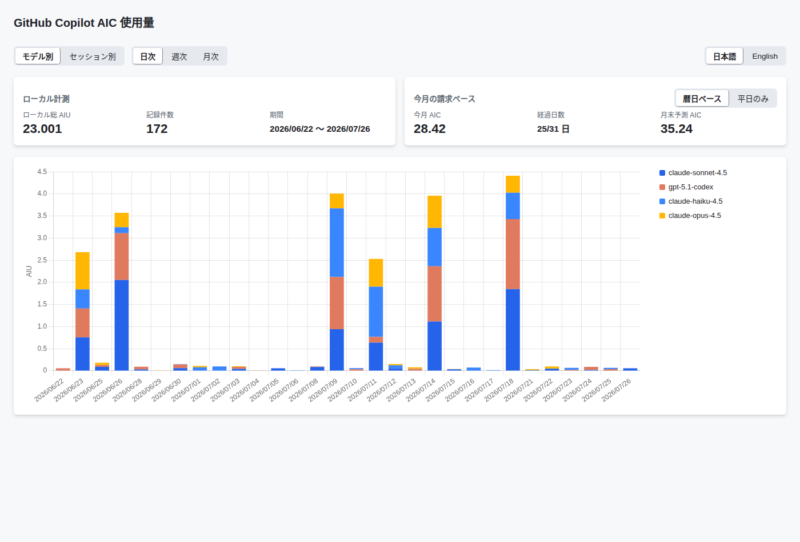
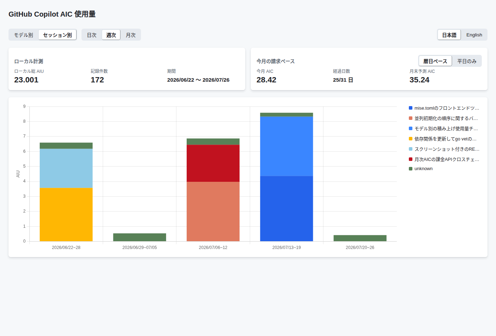
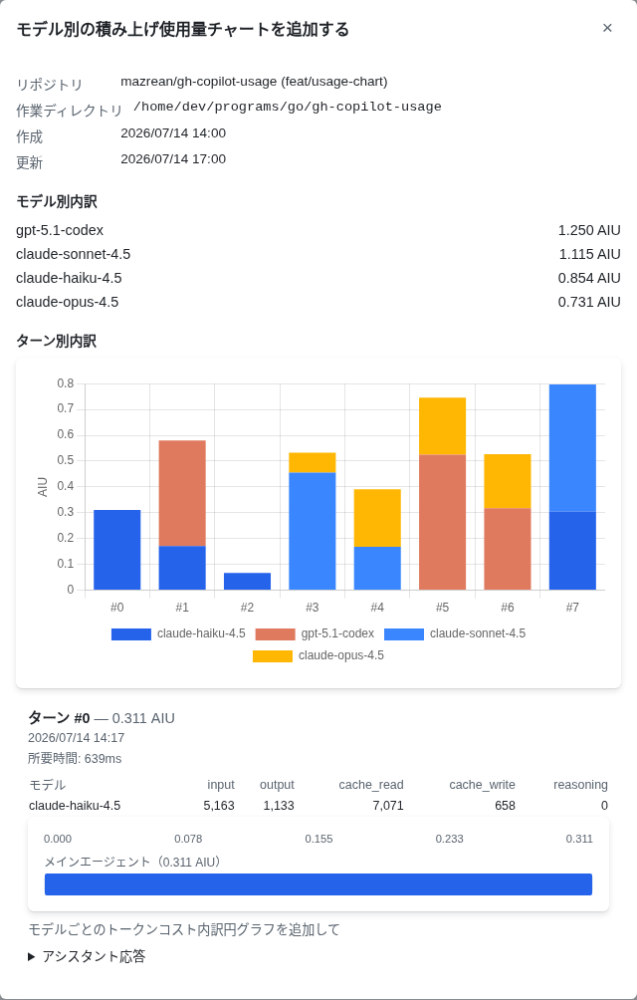
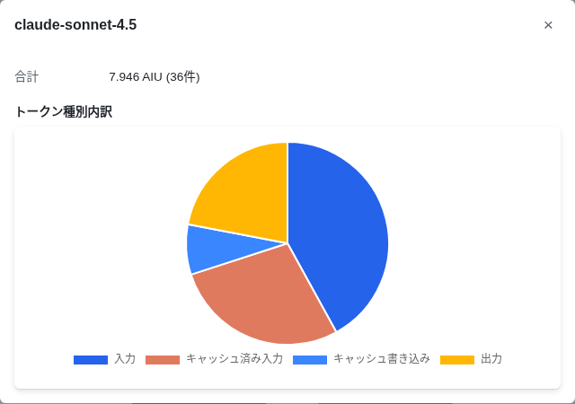

# gh-copilot-usage

[English](README.md)

GitHub Copilot CLI の AI クレジット（AIC）使用量を、積み上げ時系列チャートとしてブラウザ上に可視化する [`gh` CLI](https://cli.github.com/) 拡張機能です。GitHub の課金 API ともクロスチェックできます。

## インストール

[`gh` CLI](https://cli.github.com/) がインストール済みで、認証済み（`gh auth login`）である必要があります。

```bash
gh extension install mazrean/gh-copilot-usage
```

## 機能詳細

`gh-copilot-usage` は、Copilot CLI がローカルに保持している SQLite データベース `~/.copilot/session-store.db` を読み取り、インタラクティブなダッシュボードとして表示します。すべてローカルで完結し、ローカル DB の読み取りにはトークンが一切不要で、課金額とのクロスチェックも既存の `gh` 認証を再利用するため、別途の認証情報設定は必要ありません。

> [!NOTE]
> 集計対象は Copilot CLI のローカル `session-store.db` に記録された使用量のみです。VSCode 拡張機能など、他の IDE 統合経由の Copilot 利用は含まれません。

ダッシュボードでは、AIC 使用量を日次・週次・月次で集計してモデル別に積み上げ表示します。上部には当月の課金額合計と月末時点の使用量予測も並べて表示されます。



積み上げ軸を切り替えると、同じデータをモデル別ではなく Copilot CLI のセッション別に確認できます。以下の各セグメントが 1 つのセッションに対応します。



バーをクリックすると、そのセッションの詳細に入れます。モデル別の合計、ターンごとの AIU チャート、そして（Copilot CLI のバージョンが記録していれば）選択したターンの所要時間・トークン数・個々の呼び出し（サブエージェントへの委譲を含む）のトレースを確認できます。



モデルのセグメントをクリックすると、トークンコストのカテゴリ別内訳（入力 / キャッシュ済み入力 / キャッシュ書き込み / 出力）を確認できます。



UI 自体も、ターミナルのロケールとは独立して日本語・英語を切り替えられます（上記スクリーンショット右上のトグルを参照してください）。

## 使い方

```bash
gh copilot-usage
```

ローカルサーバーが起動し（デフォルトは `127.0.0.1:8765`。使用中の場合はランダムなポートにフォールバック）、ブラウザで開かれます。

| フラグ | デフォルト | 説明 |
| --- | --- | --- |
| `--db` | `~/.copilot/session-store.db` | 読み取る Copilot CLI のセッションストア DB のパスです。 |
| `--addr` | `127.0.0.1:8765` | Web UI を配信するアドレスです。 |
| `--no-open` | `false` | ブラウザを自動的に開きません。 |
| `--json` | `false` | 集計結果を JSON で標準出力して終了します（サーバーは起動しません）。 |
| `--dimension` | `model` | `--json` 時の積み上げ軸です: `model` または `session`。 |
| `--granularity` | `day` | `--json` 時の時間バケットです: `day` / `week` / `month`。 |

例えば、サーバーを起動せずにモデル別の週次サマリーを取得する場合は、次のようにします。

```bash
gh copilot-usage --json --dimension model --granularity week
```

### 課金額とのクロスチェック

「今月（課金ベース）」のカードは、既存の `gh` ログインを通じて GitHub の課金 API を呼び出します。トークンに `user` スコープが無い場合でも、このカードのみ「取得不可」として表示され、ページ全体は正常に動作します。有効化するには `gh auth refresh -s user` を実行してください。

## 開発

ビルド・テスト・lint コマンドについては [DEVELOPMENT.md](DEVELOPMENT.md)（英語）を参照してください。
