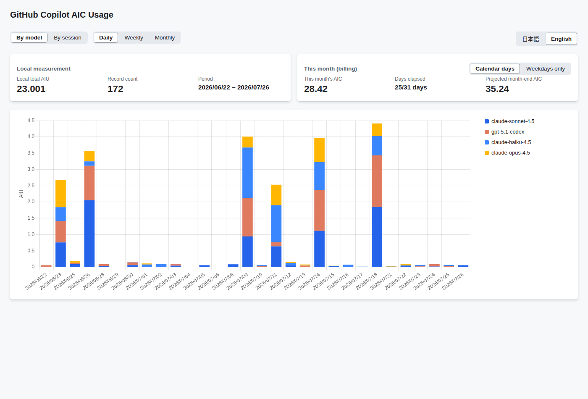
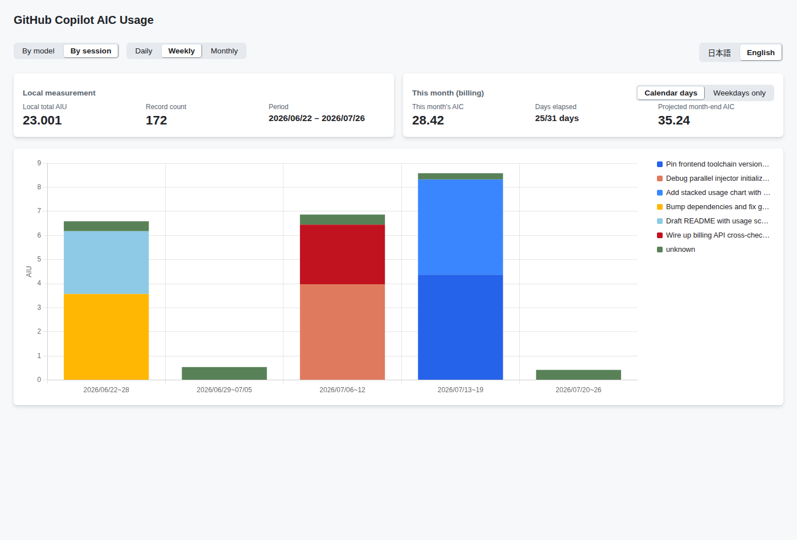
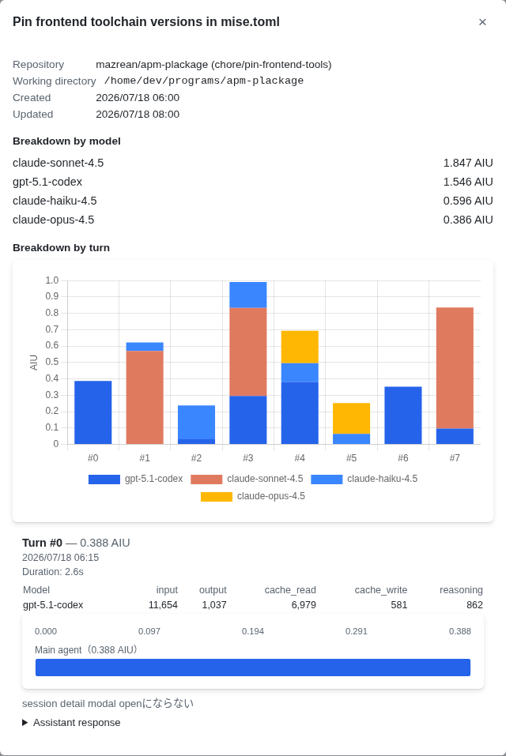
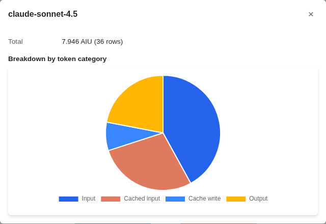

# gh-copilot-usage

[日本語](README.ja.md)

A [`gh` CLI](https://cli.github.com/) extension that visualizes your GitHub Copilot CLI AI-credit (AIC) usage as a stacked time-series chart, right in your browser — and cross-checks it against GitHub's billing API.

## Install

Requires the [`gh` CLI](https://cli.github.com/) to be installed and authenticated (`gh auth login`):

```bash
gh extension install mazrean/gh-copilot-usage
```

## Features

`gh-copilot-usage` reads `~/.copilot/session-store.db` — the local SQLite database the Copilot CLI already keeps on your machine — and turns it into an interactive dashboard. Everything runs locally: the local-DB read path needs no token at all, and the billing cross-check reuses your existing `gh` authentication — there's no separate credential setup.

> [!NOTE]
> Usage is aggregated only from the Copilot CLI's local `session-store.db`. It does **not** include Copilot usage from the VS Code extension or other IDE integrations.

The dashboard shows AI-credit usage over time bucketed daily/weekly/monthly and stacked by model, alongside this month's billing total and a month-end pace projection:



Switch the stacking dimension to see the same data broken down by Copilot CLI session instead of model — each segment below is one session:



Click a bar to drill into that session: its per-model totals, a per-turn AIU chart, and (when your Copilot CLI version records them) the selected turn's duration, token counts, and the trace of individual calls — including sub-agent delegations:



Click a model's segment instead to see its token-cost breakdown by category (input / cached input / cache write / output):



The UI itself can also be switched between English and Japanese, independent of your terminal locale — see the toggle in the top-right corner of the screenshots above.

## Usage

```bash
gh copilot-usage
```

This starts a local server (default `127.0.0.1:8765`, falling back to a random port if that one is busy) and opens it in your browser.

| Flag | Default | Description |
| --- | --- | --- |
| `--db` | `~/.copilot/session-store.db` | Path to the Copilot CLI session-store DB to read. |
| `--addr` | `127.0.0.1:8765` | Address to serve the web UI on. |
| `--no-open` | `false` | Don't open a browser automatically. |
| `--json` | `false` | Print aggregated usage as JSON and exit (no server). |
| `--dimension` | `model` | Stacking dimension for `--json`: `model` or `session`. |
| `--granularity` | `day` | Time bucket for `--json`: `day`, `week`, or `month`. |

For example, to get a weekly-by-model summary without starting the server:

```bash
gh copilot-usage --json --dimension model --granularity week
```

### Billing cross-check

The "this month (billing)" card calls the GitHub billing API through your existing `gh` login. If your token lacks the `user` scope, that card degrades gracefully (it reports the check as unavailable) instead of failing the whole page — run `gh auth refresh -s user` to enable it.

## Development

See [DEVELOPMENT.md](DEVELOPMENT.md) for build, test, and lint commands.
